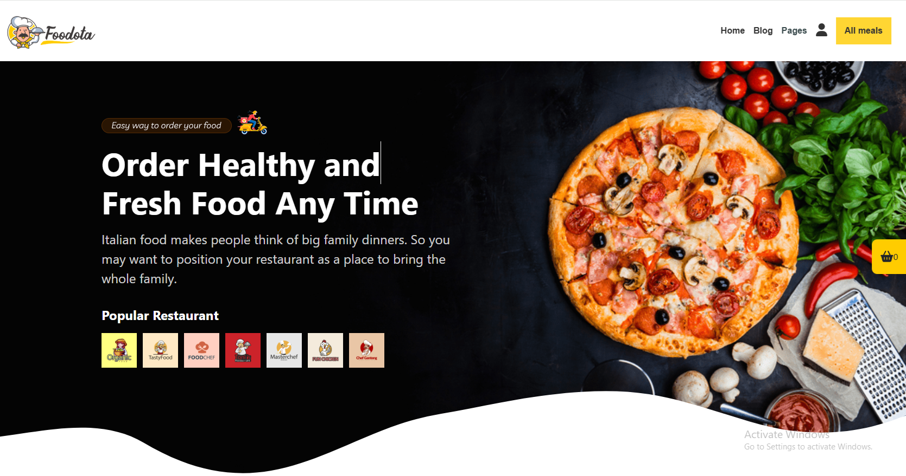

# 🍽️ Foodota - Food & Beverage Ordering Application


---

A fully integrated food and beverage ordering application built with **React** and **Redux Toolkit**. Foodota is designed as a robust, scalable e-commerce platform with a modern user interface and a powerful management system, emphasizing seamless user experience and efficient data administration.

---

## ✨ Key Features

| Feature | Description |
| :--- | :--- |
| **🛒 Shopping Cart Management** | A dynamic and efficient system for adding, removing, and adjusting product quantities. |
| **💳 Secure Payments** | Full integration with **Stripe Payment Gateway** for secure online transaction processing. |
| **🔑 User Authentication** | Secure user registration and login, including seamless **Google Sign-In** functionality via **Firebase**. |
| **📊 Admin Dashboard** | A comprehensive interface for complete store management, covering all essential e-commerce operations. |
| **📱 Responsive Design** | Modern, mobile-first design ensuring optimal viewing and interaction across all devices. |
| **📦 Data Integration** | Efficient data fetching and communication with backend APIs using **Axios**. |
| **🛠️ CRUD Operations** | Full **Create, Read, Update, Delete** capabilities implemented in the Admin Dashboard for core resources. |

---

## 🏛️ Architectural Insights & Best Practices

To ensure a robust, maintainable, and scalable application, several key architectural decisions were implemented:

### Centralized Data & State Management
**Redux Toolkit** was leveraged for efficient data fetching and predictable global state management. This is crucial for handling complex, application-wide scenarios such as:
* User authentication status and session persistence.
* Complex shopping cart operations (add/remove/update quantities).
* Handling global loading and error states.

### Clean Code & Reusability with Custom Hooks
A strong emphasis was placed on writing clean, organized, and reusable code through the extensive use of **Custom React Hooks**. This approach helped to:
* **Encapsulate** and reuse complex logic (e.g., fetching, form handling, authentication checks).
* Result in more **readable and decoupled components**.
* Significantly reduce code duplication across the application.

### UI and Styling Strategy
A hybrid styling approach combines:
* **Material-UI (MUI):** For ready-to-use, accessible, and high-quality components.
* **Bootstrap:** For quick grid layouts and foundational UI structure.
* **Sass/SCSS:** For deep customization, theming, and writing maintainable, structured, and modular CSS.

---

## 📈 Admin Dashboard Capabilities

The robust administrative interface provides full control over the e-commerce operations.

### 🌐 Access the Live Dashboard
You can access the deployed Admin Dashboard here: **[Foodota Admin Dashboard](https://foodota-app-pro.vercel.app/dashboard)**

| Section | Functionality |
| :--- | :--- |
| **Overview** | A high-level view of key store metrics and analytics (**chart.js** is used for visualization). |
| **Products Management** | Full **CRUD** operations to manage product inventory (create, view, edit, delete). |
| **Orders Management** | Detailed viewing of all orders and the ability to update order statuses (e.g., Pending, Shipped, Delivered). |
| **Users Management** | Complete **CRUD** management for user accounts. |

---

## ⚙️ Technologies & Libraries

| Category | Technologies and Libraries |
| :--- | :--- |
| **Core Frontend** | **React**, **Vite** (Build Tool), **Redux Toolkit**, **React Router DOM**. |
| **Styling & UI** | **Sass**, **Bootstrap**, **Material-UI (MUI)**, **React-Toastify**, **Slick Carousel / React-Slick**. |
| **Data & Auth** | **Axios** (HTTP Requests), **Firebase** (for Google Auth), **JWT-Decode**. |
| **Utilities** | **Moment.js** (Date/Time handling), **chart.js** (Data visualization). |
| **Icons** | **Font Awesome**. |

---

## 🚀 Getting Started

To set up and run the Foodota application locally, follow these steps:

### Prerequisites

* Node.js (LTS version recommended)
* npm or Yarn
* Git

### Setup Instructions

1.  **Clone the repository:**
    ```bash
    git clone [https://github.com/2As12im96/foodota-app-pro](https://github.com/2As12im96/foodota-app-pro)
    cd foodota-app-pro
    ```
2.  **Install dependencies:**
    ```bash
    npm install
    # or
    yarn install
    ```
3.  **Configure Environment Variables:**
    Create a file named **`.env`** in the root directory and populate it with your necessary API keys and credentials (DB URL, Stripe keys, Cloudinary keys, etc.).

4.  **Create a `.env` file:**
    Create a file named `.env` in the root of the project directory and add your environment variables.
    ```
    # Example .env content
    VITE_API_BASE_URL=[https://foodota-one.vercel.app/api](https://foodota-one.vercel.app/api)   # Your backend API URL
    VITE_STRIPE_PUBLISHABLE_KEY=pk_test_YOUR_STRIPE_PUBLISHABLE_KEY # Your Stripe Public Key
    VITE_FIREBASE_API_KEY=YOUR_FIREBASE_API_KEY
    VITE_FIREBASE_AUTH_DOMAIN=YOUR_FIREBASE_AUTH_DOMAIN
    VITE_FIREBASE_PROJECT_ID=YOUR_FIREBASE_PROJECT_ID
    VITE_FIREBASE_STORAGE_BUCKET=YOUR_FIREBASE_STORAGE_BUCKET
    VITE_FIREBASE_MESSAGING_SENDER_ID=YOUR_FIREBASE_MESSAGING_SENDER_ID
    VITE_FIREBASE_APP_ID=YOUR_FIREBASE_APP_ID
    ```
    * **Note:** For Vite, environment variables must be prefixed with `VITE_`.

5.  **Run the application:**
    ```bash
    npm run dev
    # or
    yarn dev
    ```

The application will launch in development mode, typically accessible at `http://localhost:5173`.

## 🤝 Contributing

Contributions are welcome! Please feel free to open issues or submit pull requests.

---

## 📄 License

This project is open source and available under the [MIT License](LICENSE).